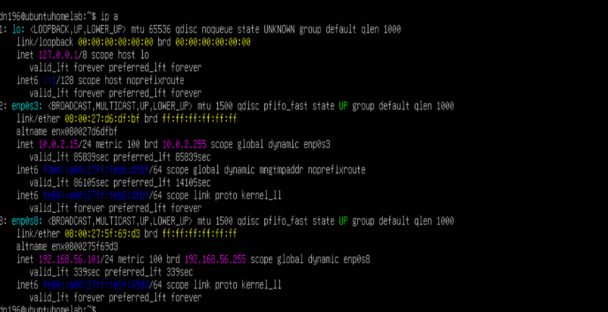
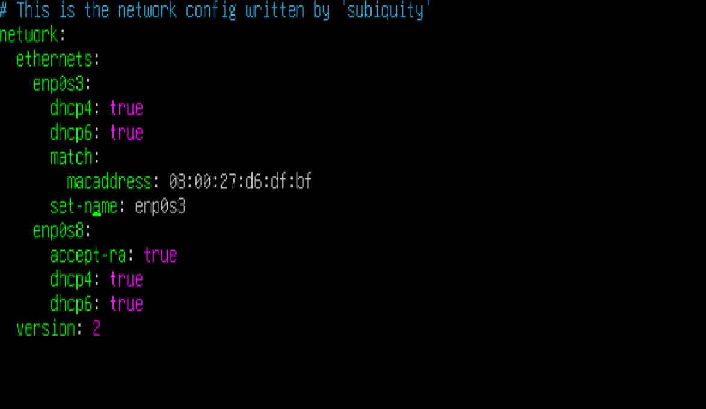
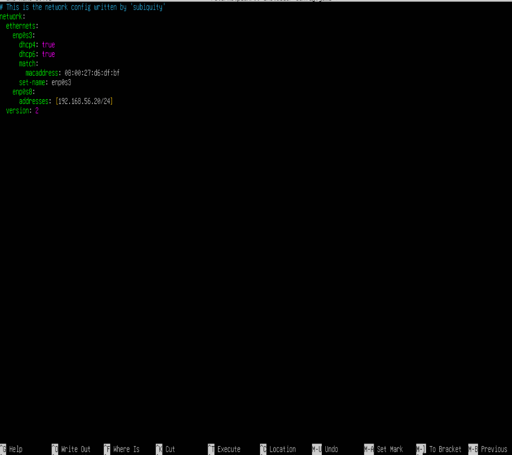
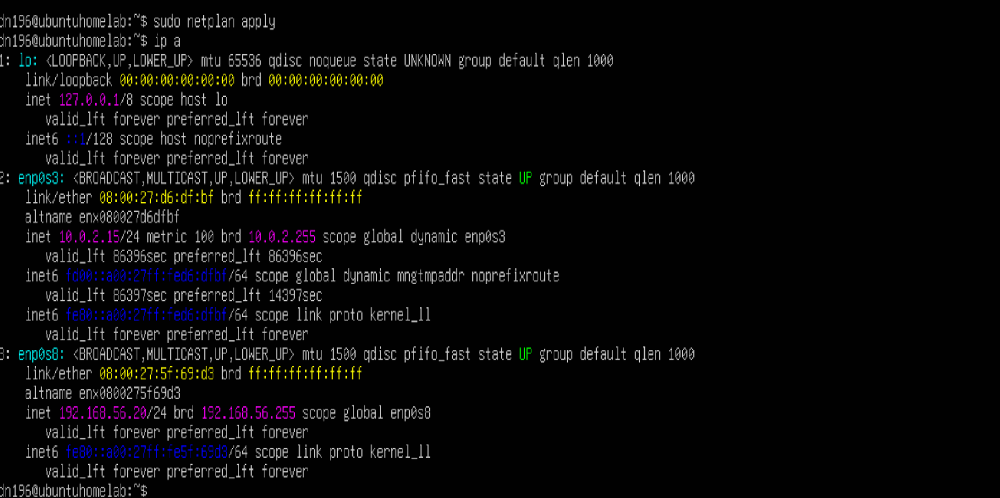
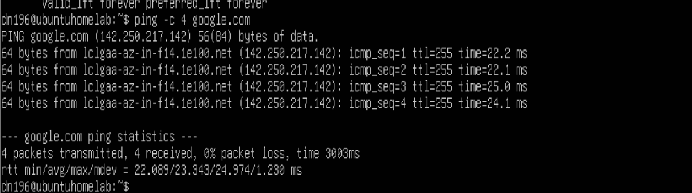
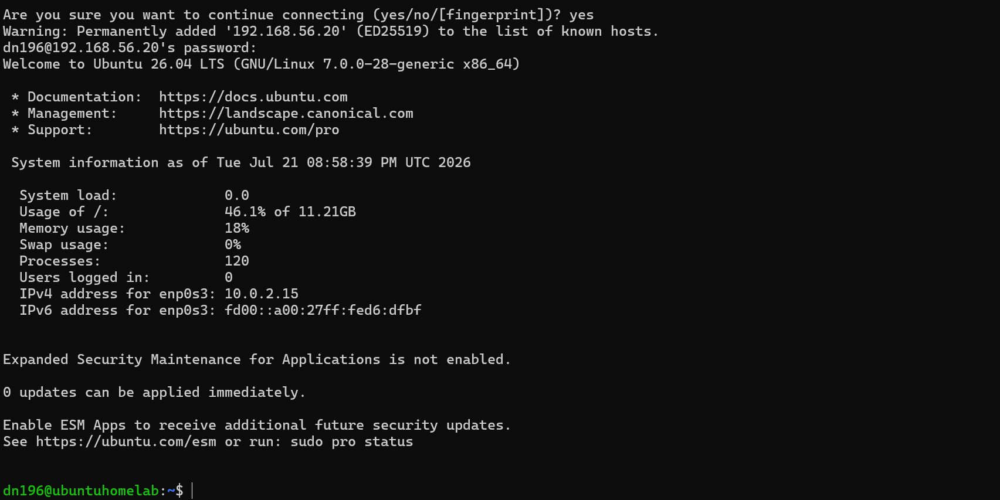
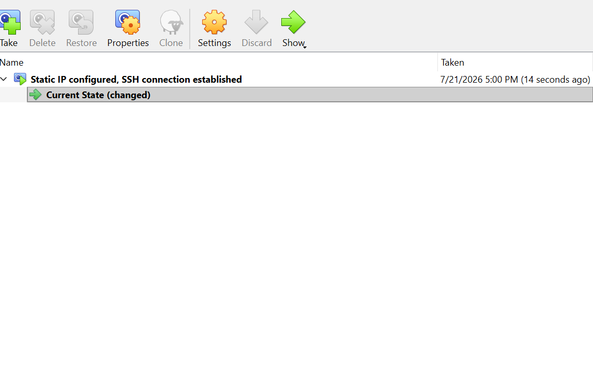

# Ubuntu Server Setup

This documents initial setup of Ubuntu Server in Virtualbox. A static IP is set and connectivity is confirmed before a snapshot is taken.

## Setting Static IP Address
After installing Ubuntu Server in Virtualbox and logging in, I first run 'ip a' to check my interface names.

Next I want to set a static IP address on my Host-Only adapter, so that I can always reach it. To accomplish this, I go into network config, and find it looking like this.

I edit the file to assign enp0s8 a static 192.168.56.20/24 address.

## Confirming connectivity

I run 'ip a' again to confirm the new static IP.

Next I ping google to confirm connectivity.

Lastly I test SSH from my Windows host OS.

Having confirmed connectivity, I take a snapshot in Virtualbox so that I can return to this base setup as needed.

