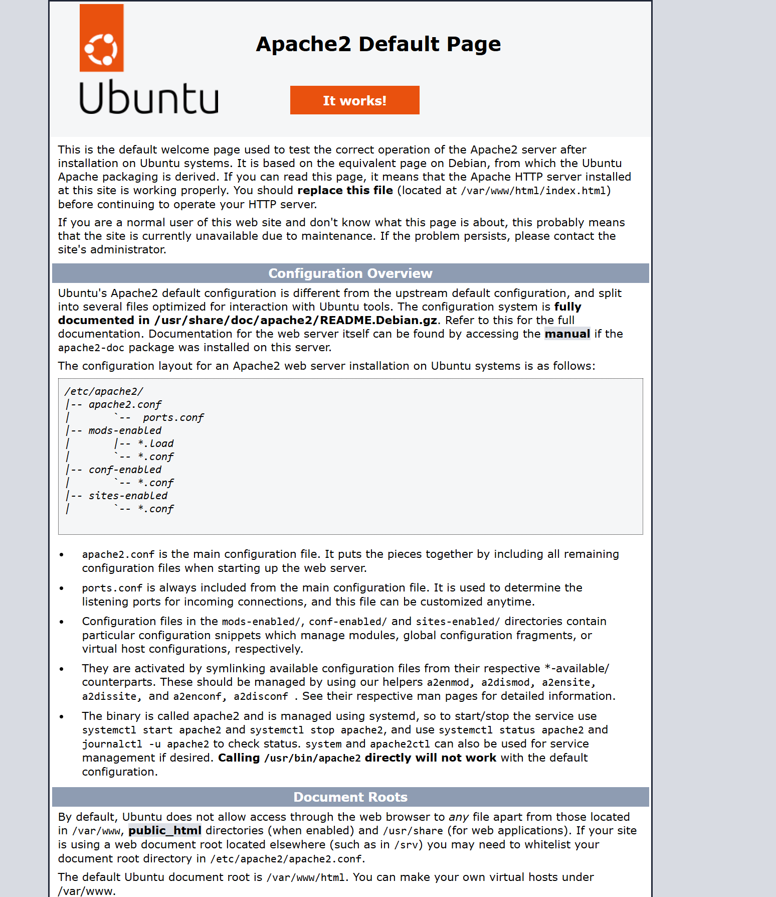
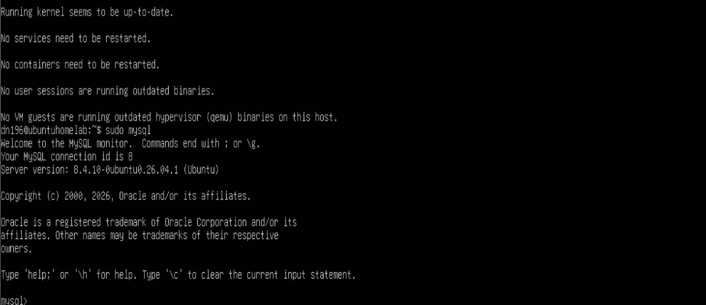
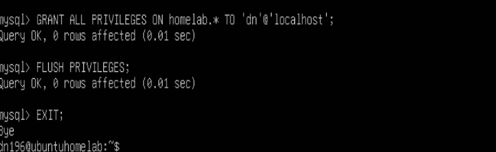
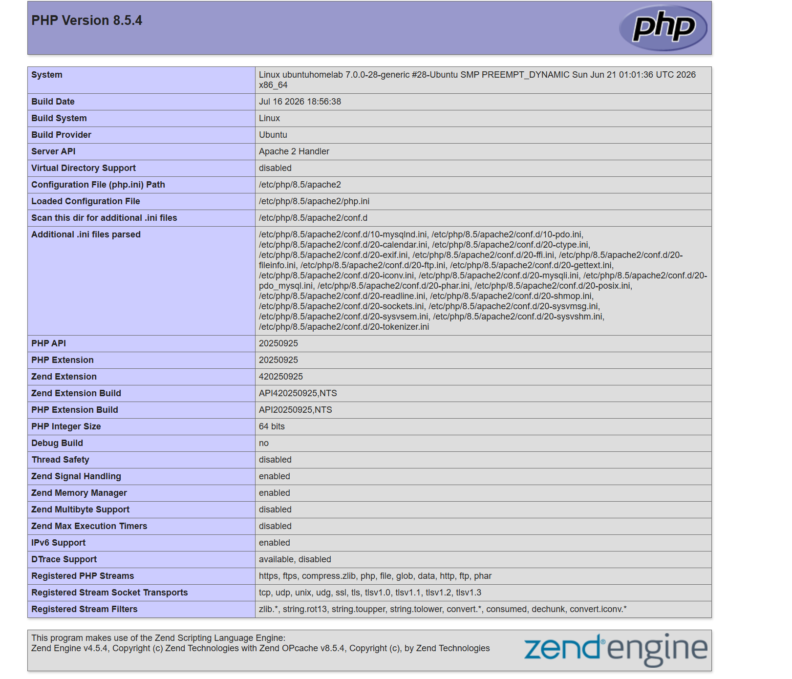
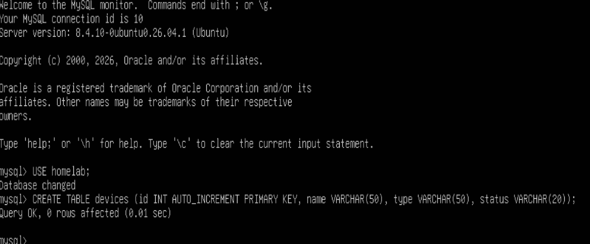
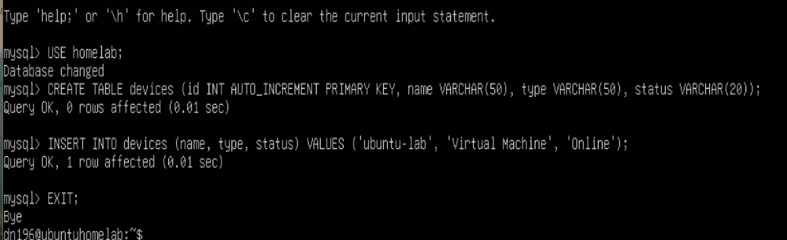
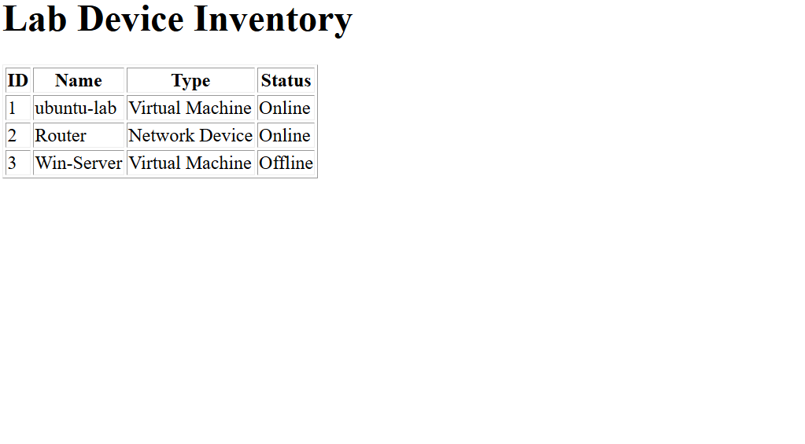
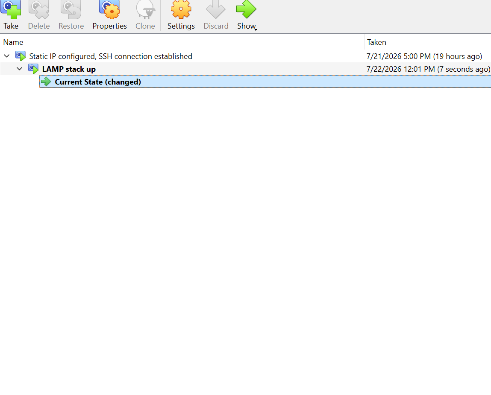

# LAMP stack setup

Expanding on my initial server setup, I setup a LAMP stack, installing and configuring Apache, MySQL and PHP, creating a simple SQL table viewable from a webpage.

## Installing Apache, MySQL and PHP

First I install Apache and confirm that it's working.

Next I installed MySQL.

Then I created a user in MySQL, and granted permissions.

After that, I installed PHP, created a file, and viewed it in a browser to confirm that it was working.

## Creating database and devices table and inserting a row

After deleting that test page, I created a database called 'homelab' and created a table for 'devices'

I added rows for three devices (after adding the row in the image, I went back and added rows for 'router' and 'windows server', the latter of which is not yet extant).

## Creating webpage with PHP and snapshotting

I created and configured php file for my devices table, and confirmed that it was up and running.

Lastly, I took a new snapshot in Virtualbox.

