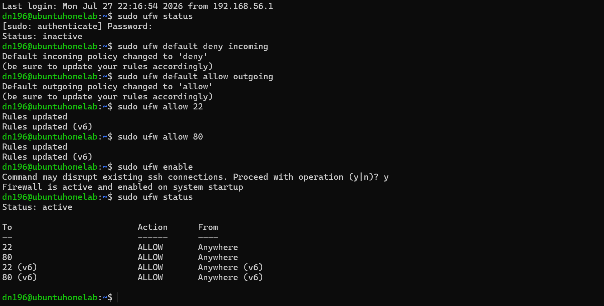
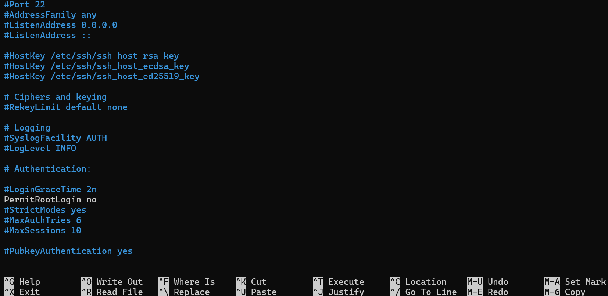
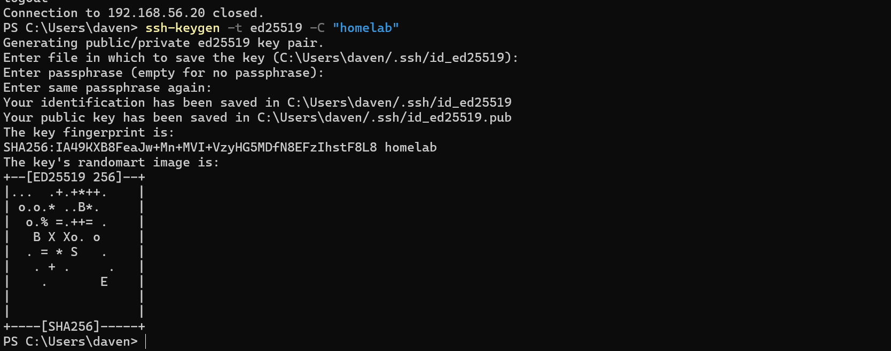
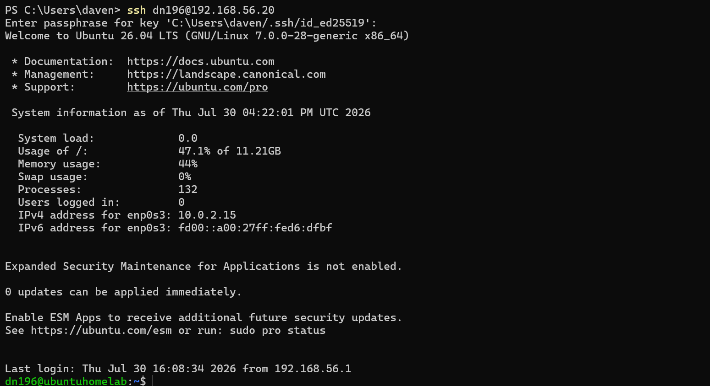
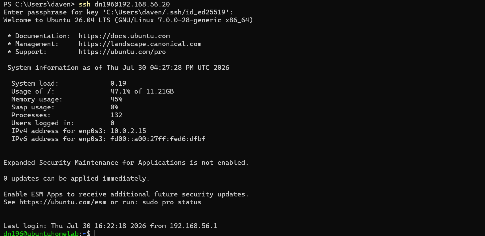
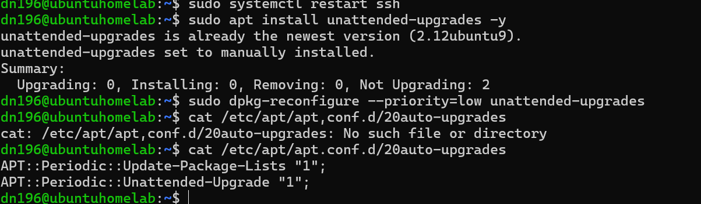
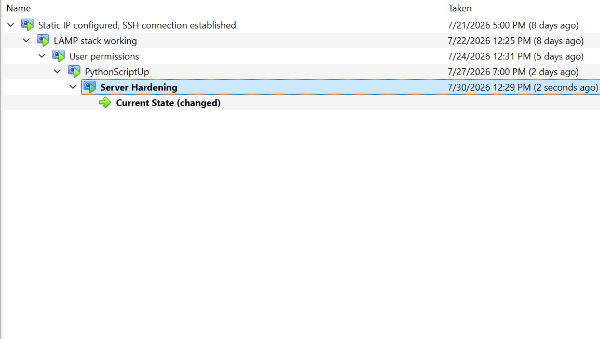

# Hardening the Ubuntu Server
For this lab, I take steps to harden my Ubuntu Server homelab- configuring a firewall, disabling access to root over SSH, setting up key-based authentication for SSH so that only my computer can access the server through SSH, disable password authentication over SSH (so that access to the server over SSH is restricted to key-based authentication) and fianlly configuring automatic security updates.

## Setting up UFW Firewall

First I confirm the (inactive) status of the UFW firewall, and then configure it to deny all incoming traffic by the fault, besides the specified ports 22 and 80 (SSH and HTTP).

## Disabling root SSH login

Next I disable root account access over SSH, giving attackers no access to it regardless of whether they know the root password.

## Setting up SSH key-based authentication

After that, I set up key based-authentication, moving away from password based auth (over SSH) and towards verification based on public a public key stored in the VM and a private key stored on the machine accessing the VM over SSH.

And I confirm that I can still access the VM over SSH with the private key on my machine.

## Disabling password authentication over SSH

With keys up and running, I next disable password-based authentication over SSH entirely, pivoting to key-only access.

And again I confirm that I can still access the VM over SSH from my machine.

## Configuring automatic security updates

As a final hardening step, I configure automatic security updates.

Lastly, I take another snapshot in Virtualbox.

