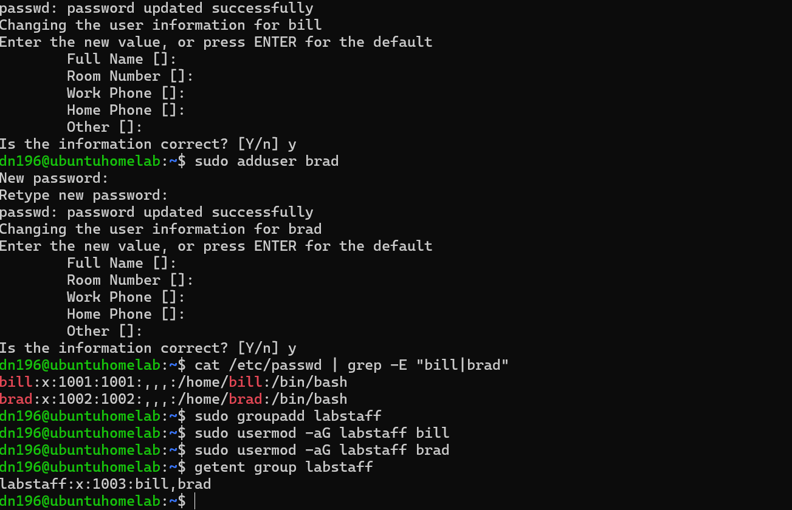
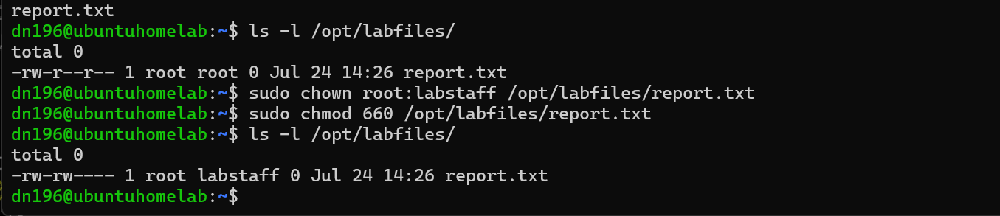
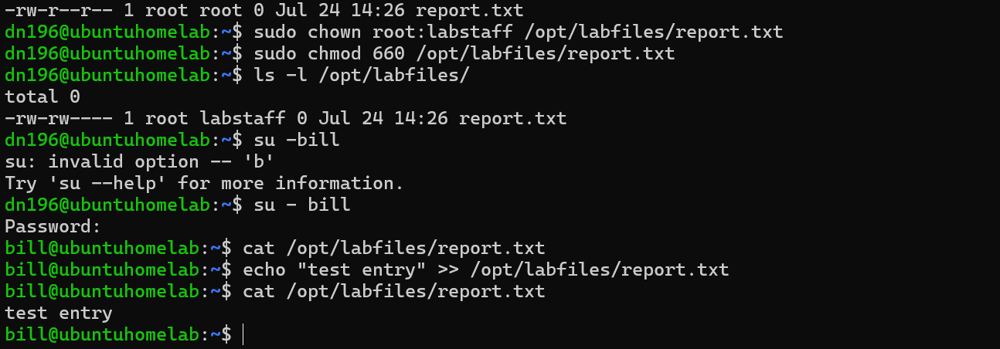
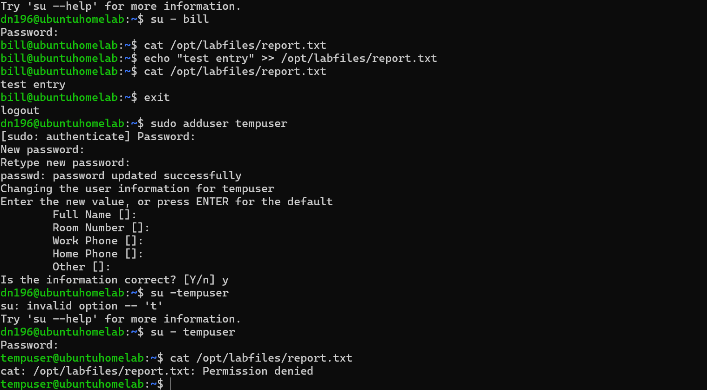
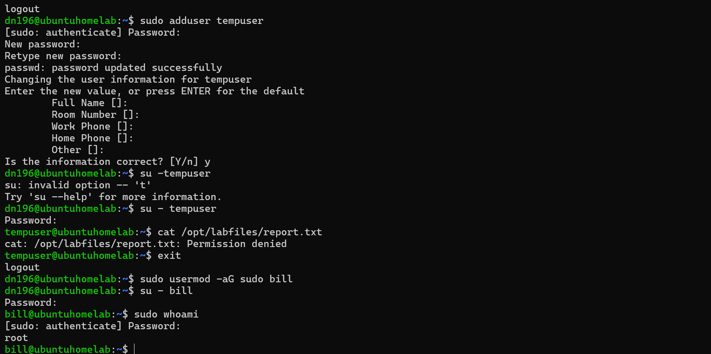
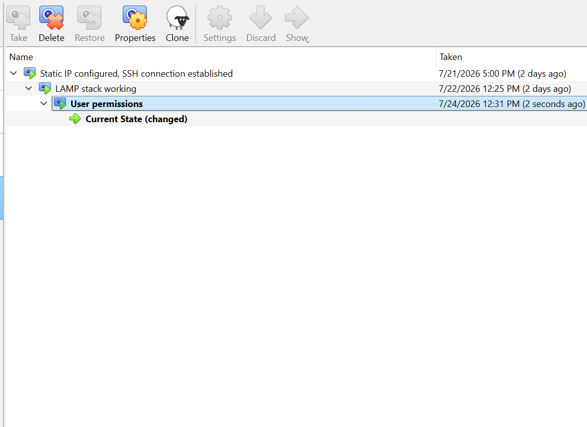

# User management and permissions

## Adding users and assigning them to a group

After booting up my virtual server, and connecting via SSH, I add two users.

Next, I create a group ('labstaff') and assign my new users to it.

Having confirmed that they are successfully assigned to the group, I create a directory and a file to practice permissions. I assign labstaff read and write permissions.

To test that permissions are working correctly, I switch over to Bill.

Next I created a temporary user with no access to the directory, to ensure that they will be denied permission.

I then give Bill sudo (root) privileges, and verify.

With everything working as expected, I take a snapshot in Virtualbox.

